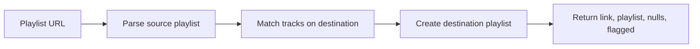

# SwitchVibes

Backend API for [SwitchVibes](https://switchvibes.xyz/), a playlist migration service. You paste a Spotify or YouTube Music playlist URL. SwitchVibes matches the tracks on the other platform, creates a new playlist, and returns the link. No access to the user's source or destination accounts is required.

Apple Music is listed as coming soon on the product site.

**Live frontend:** [https://switchvibes.xyz/](https://switchvibes.xyz/)

**API docs:** [ReDoc](https://switch-vibes-production.up.railway.app/docs/) · [Swagger](https://switch-vibes-production.up.railway.app/swagger/)

## What it does

| Direction | HTTP | WebSocket |
| --- | --- | --- |
| Spotify → YouTube Music | `POST /spotify_to_yt/` | `ws/spotify_to_yt/` |
| YouTube Music → Spotify | `POST /yt_to_spotify/` | `ws/yt_to_spotify/` |

HTTP returns when the full conversion is done. WebSockets stream progress as each track is found or missed, then send the same final payload. Prefer WebSockets for large playlists; long HTTP requests can time out.

Matched tracks with low title or artist similarity are marked `flag`. Tracks that could not be found are listed in `nulls`.



## Tech stack

- Python 3.10, Django 4.2, Django REST Framework
- Django Channels + Daphne (ASGI / WebSockets)
- Spotipy (Spotify), ytmusicapi (YouTube Music)
- drf-yasg (Swagger / ReDoc)
- SQLite (local default)
- Railway + Nixpacks in production

## How to run

### Prerequisites

- Python 3.10
- A [Spotify Developer](https://developer.spotify.com/dashboard) app (Client ID, Client Secret, redirect URI)
- YouTube Music browser headers in `yt_to_spotify/headers_auth3.json` (needed to create YouTube Music playlists). See [ytmusicapi auth](https://ytmusicapi.readthedocs.io/en/stable/setup/browser.html).

### Setup

```bash
python -m venv .venv
source .venv/bin/activate
pip install -r requirements.txt
```

Create a `.env` in the project root:

```env
DJANGO_SETTINGS_MODULE=config.settings.development
SPOTIPY_CLIENT_ID=
SPOTIPY_CLIENT_SECRET=
SPOTIFY_REDIRECT_URI=
SPOTIFY_ID=
```

`SPOTIFY_ID` is the Spotify user that owns playlists created by this API.

On first Spotify OAuth, Spotipy opens a browser and caches the token locally.

### Server

Use Daphne so both HTTP and WebSockets work:

```bash
daphne -b 127.0.0.1 -p 8000 config.asgi:application
```

`GET /` should respond with a welcome message. Open `/swagger/` or `/docs/` for the interactive spec.

## Example request / response

**Spotify → YouTube Music**

```http
POST /spotify_to_yt/
Content-Type: application/json

{
  "spotify_playlist_url": "https://open.spotify.com/playlist/37i9dQZF1DXcBWIGoYBM5M"
}
```

```json
{
  "link": "https://music.youtube.com/playlist?list=PLxxxxxxxx",
  "playlist": [
    {
      "title": "Blinding Lights",
      "artists": ["The Weeknd"],
      "duration_seconds": 200,
      "yt_id": "4NRXx6U8ABQ",
      "yt_url": "https://music.youtube.com/watch?v=4NRXx6U8ABQ",
      "flag": false
    }
  ],
  "nulls": [
    {
      "title": "Some Unavailable Track",
      "artists": ["Unknown Artist"]
    }
  ],
  "flagged": []
}
```

**YouTube Music → Spotify**

```http
POST /yt_to_spotify/
Content-Type: application/json

{
  "yt_playlist_url": "https://music.youtube.com/playlist?list=PLxxxxxxxx"
}
```

The response shape is the same (`link`, `playlist`, `nulls`, `flagged`). Spotify tracks include `uri` instead of `yt_id` / `yt_url`.

**WebSocket**

Connect to `ws://127.0.0.1:8000/ws/spotify_to_yt/` (or `ws/yt_to_spotify/`) and send the same JSON body. You will receive progress messages such as `{"message": "Searching Spotify..."}` and per-track updates, then the final payload above.

Invalid URLs return `{"detail": "...", "code": 400}`. Missing playlists return 404-style detail messages.

## Contributing

Issues and pull requests are welcome.

## Contact

- [Twitter](https://twitter.com/yensouchenna)
- [LinkedIn](https://linkedin.com/in/uche-onyenso)
